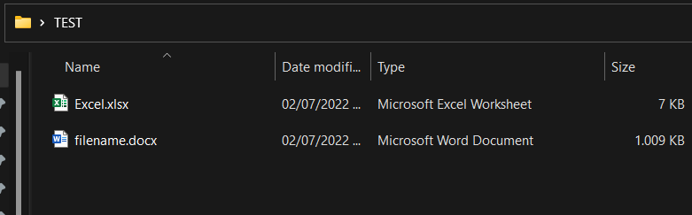
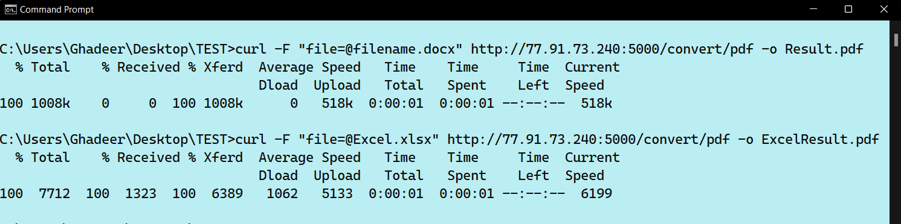
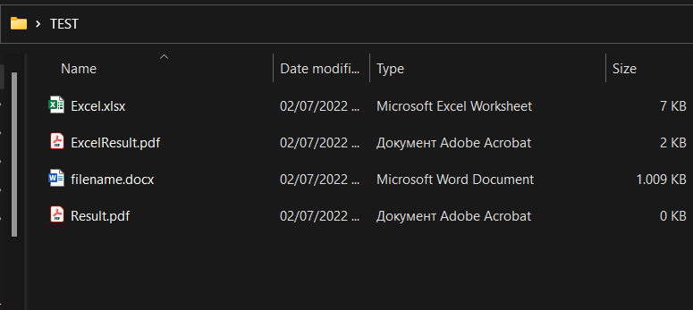
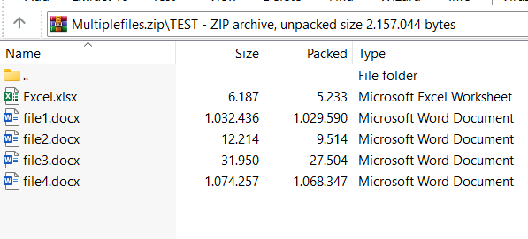
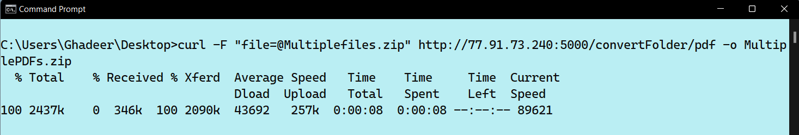
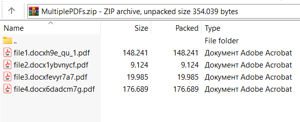

# MF-PDF
A Doc to PDF converter that uses API implementation. The program can convert multiple fils in a relatively fast speed. The program can also convert XLSX files to PDF.

## How to use
* Open any terminal
* Enter the directory of the files in the terminal
* use the command: `curl -F`
* Put in the name of the file with quotations, eg: `"file=@filename.docx"`
* If the file is an excel make sure to change the type to `xlsx`
* Put in the program on the server address: `http://77.91.73.240:5000/convert/pdf`
* For zip of multiple files conversion use: `http://77.91.73.240:5000/convertFolder/pdf`
* Put in the name of the resulted PDF after `-o`, eg:  `-o Result.pdf`
* Full command line example: `curl -F "file=@filename.docx" http://77.91.73.240:5000/convert/pdf -o Result.pdf`

## Demo Screenshots
### Single File:
Docx and Xlsx files before conversion:

Conversion process:

New PDF files in the directory:

### Multiple Files:

Zip file with the files that should be converted:

Conversion process:

New Zip folder that contains converted PDF files in the same directory:

## Features
* Simple conversion process
* No external programs needed
* Secure operation
* Fast conversion speed
* Works on all Operating Systems

## Technology and License
The program currently uses LibreOffice library
The progeam uses the MIT License
